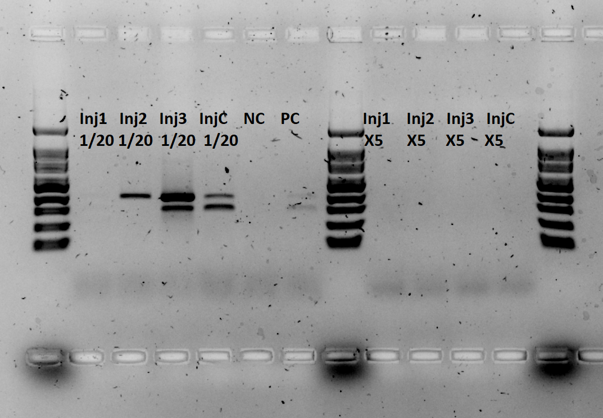

<!--
Taken from v1.0 notebook, under High priority

## March 5^th^ 2020 - PCR 

By Hagai's decree we are hereby complled to follow through rigorous polymerase chain reaction for 16 fin clip details of different zebra fishes that now lie within the incubator inside small containers numbered A5#1-A5#12. 

The ZF details are from A5 cell in the old large system, they were spawned at April 24^th^ 2019 to parents in cell E3 (old large system). The parents are "male AB tg mut" with "female AB +/-".

**ZF Detail FC sampling**

| Strip | Original system location  | Current ID | Strain | Gender | Notes                                          |
| ----- | ------------------------- | ---------- | ------ | ------ | -----                                          |
| A-1   | A5                        | A5 #1      | AB     | M      |                                                |
| A-2   | A5                        | A5 #2      | TL     | M      |                                                |
| A-3   | A5                        | A5 #3      | AB     | M      |                                                |
| A-4   | A5                        | A5 #4      | TL     | M      |                                                |
| A-5   | A5                        | A5 #5      | AB     | F      | Died                                           |
| A-6   | A5                        | A5 #6      | AB     | F      | Died                                           |
| A-7   | A5                        | A5 #7      | TL     | F      |                                                |
| A-8   | A5                        | A5 #8      | AB     | F      |                                                |
| B-1   | A5                        | A5 #9      | AB     | M      |                                                |
| B-2   | A5                        | A5 #10     | AB     | F      |                                                |
| B-3   | A5                        | A5 #11     | AB     | M      |                                                |
| B-4   | A5                        | A5 #12     | TL     | M      |                                                |
| B-5   |                           |            |        |        | Rescue-injected - take 2 µl from original conc |
| B-6   |                           |            |        |        | Rescue-injected - take 2 µl from original conc |
| B-7   |                           |            |        |        | Rescue-injected - take 2 µl from original conc |
| B-8   |                           |            |        |        | Rescue-control - take 2 µl from original conc  |

**Instructions:**

  1. Dilute strip A by $\frac{1}{10}$.
  2. Dilute new working Primers - 28F at 10µM, F1_2 at 10 µM and zfgne_Ex3_408R, each final vol. 100 µl. 10 µl primer, 90 µl DDW.
  2. Dilute strip B, 1-4 by $\frac{1}{10}$. - 1 µL DNA, 9 µL DDW.
  3. Generate PCR mix without DNA.
  4. PCR Strip A.1:
      1. A5#1
      2. A5#2
      3. A5#3
      4. A5#4
      5. A5#5
      6. A5#6
      7. A5#7
      8. A5#8
  5. PCR Strip B.1:
      1. A5#9
      2. A5#10
      3. A5#11
      4. A5#12
      5. Rescue-injected - take 2 µl from original conc
      6. Rescue-injected - take 2 µl from original conc
      7. Rescue-injected - take 2 µl from original conc
      8. Rescue-control - take 2 µl from original conc
  6. PCR Strip C - controls:
      1. NG
      2. Positive control /w DNA Ko, a cDNA from a knockout
      3. `-`
      4. `-`
      5. `-`
      6. `-`
      7. `-`
      8. `-`
  7. PCR: T~A~ 60.4°C, 35 cycles, F1_2wts [HL]
  8. Gel prep:
      1. mix 0.375 g agarose /w 25 ml TBE and 1.5 µL dye.
      2. Load 12 µl sample, 3µL M100bp.
      3. 110V, 40 min, 1.5%

    
    
  
  
    
**PCR Mix for 18 reaction**

```{r, PCR Mix for 18 rxn, echo = FALSE}
Material <- c("DNA", "pF",
             "pR", "F1.2", "GoTaq",
             "DDW", "final volume")
Unit<- c("µl","µl","µl","µl","µl","µl","µl")
X1<- c(2,1,1,1,12.5,7.5,25)
X18<-X1*18

df<-data.frame(Material,Unit,X1,X18)

library(knitr)
library(kableExtra)
kable(df, "latex", booktabs = TRUE) %>%
  kable_styling(latex_options = "striped")
```

**Gel loading table:**

```{r, gelPCRA5Details, echo=FALSE}
GelDF<-read.csv("tables/GelPCRtempA5details4March2020.csv",header = TRUE)
library(knitr)
library(kableExtra)
kable(GelDF, "latex", booktabs = TRUE) %>%
  kable_styling(latex_options = "striped")
```

**Results:**


1.5% agarose gel, 110V for 40 min.

Second row ran outside of gel, no negative control or positive control. Samples are noted as A5#<sample number>, Negative control noted as NC, Positive control noted as PC. Samples A5#1, #2, #3, #6, #8, #10 and #11 show 2 bands (200 & 300 bp). Samples A5#4, #5, #7, #9 and #12 show a single band (300bp).

**Notes:**

Hagai’s primers were left at Nataly’s and Bar’s box - [see image](../images/hagaisprimerslocation4mar2020.jpg).

For future reference: can we throw these? (pile of DNA extract tubes from A5 large system spawn) - [see image](images/pileoftubes4mar2020.jpg)

KO DNA sample left on yellow plate inside fume hood (right bottom corner).

**March 5^th^ 2020 - Samples B-5 to B-8 repeat.**

*Hypothesis:* Either something blocks the PCR, be it excess DNA or lack of DNA. 

We try high dilution and high concentration of the prior DNA extract samples.

**Instructions:**

1. Prepare reaction mixes A and B as follows.
2. Dilute extracted DNA for injected details (Strip B, 6-8) to $\frac{1}{40}$ as described in Strip A table.
3. Prepare PCR as follows in Stip Z and F tables.

### Mix A:

```{r, PCR Mix for X1by40 rxn, echo = FALSE}
Material <- c("DNA", "pF",
             "pR", "F1.2", "GoTaq",
             "DDW", "final volume")
Unit<- c("µl","µl","µl","µl","µl","µl","µl")
X1<- c(2,1,1,1,12.5,7.5,25)
X6<-X1*6

df<-data.frame(Material,Unit,X1,X6)

library(knitr)
library(kableExtra)
kable(df, "latex", booktabs = TRUE) %>%
  kable_styling(latex_options = "striped")
```


### Mix B:

```{r, PCR Mix for X5 rxn, echo = FALSE}
Material <- c("DNA", "pF",
             "pR", "F1.2", "GoTaq",
             "DDW", "final volume")
Unit<- c("µl","µl","µl","µl","µl","µl","µl")
X1<- c(5,1,1,1,12.5,4.5,25)
X4<-X1*4

df<-data.frame(Material,Unit,X1,X4)

library(knitr)
library(kableExtra)
kable(df, "latex", booktabs = TRUE) %>%
  kable_styling(latex_options = "striped")
```
-->
**Strip A:**

|A|8|7|6|5|4|3|2|1|Load Vol|
|-|-|-|-|-|-|-|-|-|-|
|Sample|Inj1 X1|Inj2 X1|Inj3 X1|InjC X1|| | | | |1µL|
|Sample|DDW|DDW|DDW|DDW|| | | | |49µL|


**Strip Z:**

|Z|1|2|3|4|5|6|7|8|Load Vol|
|-|-|-|-|-|-|-|-|-|-|
|Sample|$\frac{1}{40}$ Inj1|$\frac{1}{40}$ Inj2|$\frac{1}{40}$ Inj3|$\frac{1}{40}$ InjC|NC|PC| | |2µL|
|Mix|A|A|A|A|||||23µL|

**Strip F:**

|F|1|2|3|4|5|6|7|8|Load Vol|
|-|-|-|-|-|-|-|-|-|-|
|Sample|Inj1 X1|Inj2 X1|Inj3 X1|InjC X1|| | | | |5µL|
|Mix|B|B|B|B|||||20µL|


**Results:**




Inj# - injected embryow <number>, NC - Negarive control, PC - Positive control.


### Gel Electroporesis Results For A5 details PCR for exon 13 

1.5% agarose gel, 110V for 40 min.

Second row ran outside of gel, no negative control or positive control. Samples are noted as `A5#<sample number>`, Negative control noted as `NC`, Positive control noted as `PC`.
Samples A5#1, #2, #3, #6, #8, #10 and #11 show 2 bands (200 & 300 bp). Samples A5#4, #5, #7, #9 and #12 show a single band (300bp).

**NOTES:**

Hagai's primers were left at Nataly's and Bar's box - [\textcolor{purple}{see image}](../images/hagaisprimerslocation4mar2020.jpg).

For future reference: can we throw these? (pile of DNA extract tubes from A5 large system spawn) [\textcolor{purple}{see image}](images/pileoftubes4mar2020.jpg).

KO DNA sample left on yellow plate inside fume hood (right bottom corner).


