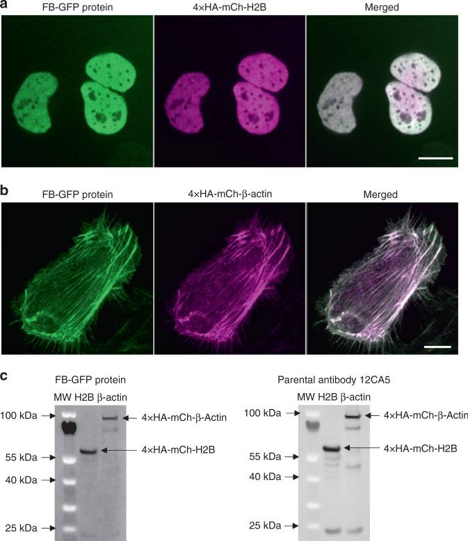
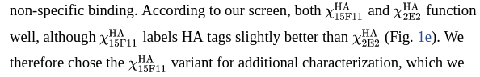

<!--
Taken from v1.0 notebook, under High priority -->

## March 5^th^ 2020 - PCR 

By Hagai's decree we are hereby complled to follow through rigorous polymerase chain reaction for 16 fin clip details of different zebra fishes that now lie within the incubator inside small containers numbered A5#1-A5#12. 

The ZF details are from A5 cell in the old large system, they were spawned at April 24^th^ 2019 to parents in cell E3 (old large system). The parents are "male AB tg mut" with "female AB +/-".

**ZF Detail FC sampling**

| Strip | Original system location  | Current ID | Strain | Gender | Notes                                          |
| ----- | ------------------------- | ---------- | ------ | ------ | -----                                          |
| A-1   | A5                        | A5 #1      | AB     | M      |                                                |
| A-2   | A5                        | A5 #2      | TL     | M      |                                                |
| A-3   | A5                        | A5 #3      | AB     | M      |                                                |
| A-4   | A5                        | A5 #4      | TL     | M      |                                                |
| A-5   | A5                        | A5 #5      | AB     | F      | Died                                           |
| A-6   | A5                        | A5 #6      | AB     | F      | Died                                           |
| A-7   | A5                        | A5 #7      | TL     | F      |                                                |
| A-8   | A5                        | A5 #8      | AB     | F      |                                                |
| B-1   | A5                        | A5 #9      | AB     | M      |                                                |
| B-2   | A5                        | A5 #10     | AB     | F      |                                                |
| B-3   | A5                        | A5 #11     | AB     | M      |                                                |
| B-4   | A5                        | A5 #12     | TL     | M      |                                                |
| B-5   |                           |            |        |        | Rescue-injected - take 2 µl from original conc |
| B-6   |                           |            |        |        | Rescue-injected - take 2 µl from original conc |
| B-7   |                           |            |        |        | Rescue-injected - take 2 µl from original conc |
| B-8   |                           |            |        |        | Rescue-control - take 2 µl from original conc  |

**Instructions:**

  1. Dilute strip A by $\frac{1}{10}$.
  2. Dilute new working Primers - 28F at 10µM, F1_2 at 10 µM and zfgne_Ex3_408R, each final vol. 100 µl. 10 µl primer, 90 µl DDW.
  2. Dilute strip B, 1-4 by $\frac{1}{10}$. - 1 µL DNA, 9 µL DDW.
  3. Generate PCR mix without DNA.
  4. PCR Strip A.1:
      1. A5#1
      2. A5#2
      3. A5#3
      4. A5#4
      5. A5#5
      6. A5#6
      7. A5#7
      8. A5#8
  5. PCR Strip B.1:
      1. A5#9
      2. A5#10
      3. A5#11
      4. A5#12
      5. Rescue-injected - take 2 µl from original conc
      6. Rescue-injected - take 2 µl from original conc
      7. Rescue-injected - take 2 µl from original conc
      8. Rescue-control - take 2 µl from original conc
  6. PCR Strip C - controls:
      1. NG
      2. Positive control /w DNA Ko, a cDNA from a knockout
      3. `-`
      4. `-`
      5. `-`
      6. `-`
      7. `-`
      8. `-`
  7. PCR: T~A~ 60.4°C, 35 cycles, F1_2wts [HL]
  8. Gel prep:
      1. mix 0.375 g agarose /w 25 ml TBE and 1.5 µL dye.
      2. Load 12 µl sample, 3µL M100bp.
      3. 110V, 40 min, 1.5%

    
    
  
  
    
**PCR Mix for 18 reaction**

```{r, PCR Mix for 18 rxn, echo = FALSE}
Material <- c("DNA", "pF",
             "pR", "F1.2", "GoTaq",
             "DDW", "final volume")
Unit<- c("µl","µl","µl","µl","µl","µl","µl")
X1<- c(2,1,1,1,12.5,7.5,25)
X18<-X1*18

df<-data.frame(Material,Unit,X1,X18)

library(knitr)
library(kableExtra)
kable(df, "latex", booktabs = TRUE) %>%
  kable_styling(latex_options = "striped")
```

**Gel loading table:**

```{r, gelPCRA5Details, echo=FALSE}
GelDF<-read.csv("tables/GelPCRtempA5details4March2020.csv",header = TRUE)
library(knitr)
library(kableExtra)
kable(GelDF, "latex", booktabs = TRUE) %>%
  kable_styling(latex_options = "striped")
```

**Results:**


1.5% agarose gel, 110V for 40 min.

Second row ran outside of gel, no negative control or positive control. Samples are noted as A5#<sample number>, Negative control noted as NC, Positive control noted as PC. Samples A5#1, #2, #3, #6, #8, #10 and #11 show 2 bands (200 & 300 bp). Samples A5#4, #5, #7, #9 and #12 show a single band (300bp).

**Notes:**

Hagai’s primers were left at Nataly’s and Bar’s box - [see image](../images/hagaisprimerslocation4mar2020.jpg).

For future reference: can we throw these? (pile of DNA extract tubes from A5 large system spawn) - [see image](images/pileoftubes4mar2020.jpg)

KO DNA sample left on yellow plate inside fume hood (right bottom corner).

**March 5^th^ 2020 - Samples B-5 to B-8 repeat.**

*Hypothesis:* Either something blocks the PCR, be it excess DNA or lack of DNA. 

We try high dilution and high concentration of the prior DNA extract samples.

**Instructions:**

1. Prepare reaction mixes A and B as follows.
2. Dilute extracted DNA for injected details (Strip B, 6-8) to $\frac{1}{40}$ as described in Strip A table.
3. Prepare PCR as follows in Stip Z and F tables.

### Mix A:

```{r, PCR Mix for X1by40 rxn, echo = FALSE}
Material <- c("DNA", "pF",
             "pR", "F1.2", "GoTaq",
             "DDW", "final volume")
Unit<- c("µl","µl","µl","µl","µl","µl","µl")
X1<- c(2,1,1,1,12.5,7.5,25)
X6<-X1*6

df<-data.frame(Material,Unit,X1,X6)

library(knitr)
library(kableExtra)
kable(df, "latex", booktabs = TRUE) %>%
  kable_styling(latex_options = "striped")
```


### Mix B:

```{r, PCR Mix for X5 rxn, echo = FALSE}
Material <- c("DNA", "pF",
             "pR", "F1.2", "GoTaq",
             "DDW", "final volume")
Unit<- c("µl","µl","µl","µl","µl","µl","µl")
X1<- c(5,1,1,1,12.5,4.5,25)
X4<-X1*4

df<-data.frame(Material,Unit,X1,X4)

library(knitr)
library(kableExtra)
kable(df, "latex", booktabs = TRUE) %>%
  kable_styling(latex_options = "striped")
```
-->
**Strip A:**

|A|8|7|6|5|4|3|2|1|Load Vol|
|-|-|-|-|-|-|-|-|-|-|
|Sample|Inj1 X1|Inj2 X1|Inj3 X1|InjC X1|| | | | |1µL|
|Sample|DDW|DDW|DDW|DDW|| | | | |49µL|


**Strip Z:**

|Z|1|2|3|4|5|6|7|8|Load Vol|
|-|-|-|-|-|-|-|-|-|-|
|Sample|$\frac{1}{40}$ Inj1|$\frac{1}{40}$ Inj2|$\frac{1}{40}$ Inj3|$\frac{1}{40}$ InjC|NC|PC| | |2µL|
|Mix|A|A|A|A|||||23µL|

**Strip F:**

|F|1|2|3|4|5|6|7|8|Load Vol|
|-|-|-|-|-|-|-|-|-|-|
|Sample|Inj1 X1|Inj2 X1|Inj3 X1|InjC X1|| | | | |5µL|
|Mix|B|B|B|B|||||20µL|


**Results:**


Inj# - injected embryow \<number\>, NC - Negarive control, PC - Positive control.


### Gel Electroporesis Results For A5 details PCR for exon 13 

1.5% agarose gel, 110V for 40 min.

Second row ran outside of gel, no negative control or positive control. Samples are noted as `A5#<sample number>`, Negative control noted as `NC`, Positive control noted as `PC`.
Samples A5#1, #2, #3, #6, #8, #10 and #11 show 2 bands (200 & 300 bp). Samples A5#4, #5, #7, #9 and #12 show a single band (300bp).

**NOTES:**


For future reference: can we throw these? (pile of DNA extract tubes from A5 large system spawn) [\textcolor{purple}{see image}](images/pileoftubes4mar2020.jpg).

KO DNA sample left on yellow plate inside fume hood (right bottom corner).


# 19June2020 Fin clips, 19-20 May 2020 - Planning

Fin clip for mut zfGNE and model ZF from May 2020 
**Introduction:** During 19-20 may 2020 we collected fin flips from M743T KI ZF, mut zfGNE and hGNE zf KO models. 

**Strip Z contained KI ZF as follows**

| Strip position | Expected genotype | Fish physical position |
| :-------------:|-------------------|:----------------------:|
| 1              |  M743T            | A1                     |
| 2              |  M743T            | A2                     |
| 3              |  M743T            | A3                     |
| 4              |  Alon alpha actin |                        |
| 5              |  Alon alpha actin |                        |
| 6              |  M743T            | A6                     |
| 7              |  M743T            | A7                     |
| 8              |  M743T            | A8                     |

Even though we took FC of 4 and 5 (strip positions) we won't sequence them since there's no need to, we do need to breed them though. 

**strip y goes as follows:**

| strip position  | expected genotype          | fish physical position   |
| :-------------: | -------------------------- | :----------------------: |
| 1               | AB tg mut Cross TL zfGNE   | A9                       |
| 2               | AB tg mut Cross TL zfGNE   | A10                      |
| 3               | AB tg mut Cross TL zfGNE   | A11                      |
| 4               |                            |                          |
| 5               |                            |                          |
| 6               |                            |                          |
| 7               |                            |                          |
| 8               |                            |                          |

Beyond that we also got Strips A-D which contain FC from 15 dpf larvae that urgently need to be placed into a container.

\newpage
\blandscape

```{r, echo=FALSE}
x<-read.csv('tables/FCmaypoorlarvae.csv')
library(knitr)
library(kableExtra)
kable(x, "latex", booktabs = TRUE) %>%
  kable_styling(latex_options = "striped")
```


\elandscape

\pagebreak{}{}

### PCR mixes:

**For Strip Z:**

```{r, echo=FALSE}
x<-read.csv('tables/9junePCRmix.csv')
library(knitr)
library(kableExtra)
kable(x, "latex", booktabs = TRUE) %>%
  kable_styling(latex_options = "striped")
```

**For the rest:**

**WTS:**
```{r, echo=FALSE}
x<-read.csv('tables/9june2020PCRtableWTS.csv')
library(knitr)
library(kableExtra)
kable(x, "latex", booktabs = TRUE) %>%
  kable_styling(latex_options = "striped")
```
**F1_2**
```{r, echo=FALSE}
x<-read.csv('tables/9june2020PCRF1_2.csv')
library(knitr)
library(kableExtra)
kable(x, "latex", booktabs = TRUE) %>%
  kable_styling(latex_options = "striped")
```

## 15July2020 zFish Talk:

Today I mostly studies for an exam.  After thought, I would like to start grafting the plasmids I need. Inquiring Hagai revealed that there should be some plasmids containing both hGNE and zfGNE somewhere in our lab. Thus, I can start looking at pc maps and look for RE and methods for inserting mutations.  

**To-Do:**  
* Physically find plasmid tubes.  
* Locate pc maps.  
* Dig through methods.  

` END OF TRANSMISSION `

## 16July2020 zFish Talk:

---------
16July2020
---------

**First and foremost:**   
[Addgene blog on frankenbodies](https://blog.addgene.org/ha-frankenbody-a-new-imaging-tool-to-visualize-single-molecules-and-nascent-peptides)  
[Addgene Plasmid order page - FB](https://www.addgene.org/browse/article/28203855/)  

**Secondly:**

Today we discussed the directions and path of my research.

**DNA level:**  
As I came up with some issues with my injections, you suggested me to make some
adjustments to my injection mix from HD template concentration to injection volume adjustment.
Furthermore, I will look into more options for using enhancer and inhibitor materials including
the ones in our lab.  

**Protein level:**  
I got green light on the frankenbodies (FB), and as we discussed the immediate phase is
to check FB's activity in zebrafish (ZF) with a "dud" protein from Avi's HA tagged protein plasmid.
To do so I will have to inoculate the plasmid in e-coli, T7 transcribe it *in-vitro* and
finally inject both FB mRNA and Avi's HA tagged protein. The end result is specific illumination
of the HA tagged plasmid. After that we can go shenanigans and construct different GNE mutant HA
tagged protein plasmids, then onwards to inject KO ZF.

*ZF KO rescue:* First thing needed to be examined is if hGNE^wt^ can actually rescue KO ZF.
I need to either acquire hGNE^wt^ containing plasmid or construct one. After acquisition of hGNE^wt^
will inject KO ZF and proceed to examine dead~tf~-dead~ti~ between KO injected and KO un-injected. If
KO injected with hGNE~wt~ we can conclude that hGNE can rescue and thus we can use it to perform
recombinant protein injections.

*FB highlight:* The highlight of the frankenbodies will be finally verified one we can visualize the
protein in gel or western using fluorescent assay. (IF) After which we can proceed to examine PTM on
the protein. Furthermore, we can see, *in-vivo* if the protein aggregates in tissues. 

Lastly, after fluorescence is achieved *in-vivo* using FB, we can examine how long the proteins
last in the tissue, if mutations cause change in λ of the protein; if epimerase mutations rescue
and if only epimerase part of the GNE can rescue.

**Metabolite level:** 

```
if t>=365/2 TRUE
else
FALSE
```

` END OF TRANSMISSION `

## 17July2020 zFish Talk 

---------
17July2020
---------

**Fluorescent immunoassay:**

>"We next tested the suitability of the HA frankenbody for Western blotting. For this, we harvested U2OS cells expressing HA-tagged H2B or β-actin. In contrast to the parental 12CA5 anti-HA antibody, which we had to stain with a secondary antibody, we could detect the frankenbody in blots using the GFP signal alone. Similar bands were seen in both cases ([Fig. 3c](https://www.ncbi.nlm.nih.gov/corecgi/tileshop/tileshop.fcgi?p=PMC3&id=791489&s=89&r=1&c=1) and Supplementary Fig. 3). Although several of the bands were dimmer than those using the antibody, we attributed the difference to signal amplification from the secondary antibody. Together, our Western blot and immunostaining results demonstrate the HA frankenbody can serve as a cost-effective replacement for the anti-HA antibody in widely used in vitro applications." - Zhao 2019


{ width=35% }

Also:

>"MCP-HaloTag was purified by immobilized metal affinity chromatography. Briefly, the His-tagged MCP-HaloTag was purified through a Ni-NTA-agarose (Qiagen) packed column per the manufacturer’s instructions, with minor modifications. E. coli expressing the interested protein was lysed in a PBS buffer with a complete set of protease inhibitors (Roche) and 10 mM imidazole. The resin was washed with PBS-based buffer containing 20 and 50 mM imidazole. The protein was then eluted in a PBS buffer with 300 mM imidazole. The eluted His-tagged MCP was dialyzed in a HEPES-based buffer (10% glycerol, 25 mM HEPES pH 7.9, 12.5 mM MgCl2, 100 mM KCl, 0.1 mM EDTA, 0.01% NP-40 detergent, and 1 mM DTT), snap-frozen in liquid nitrogen, and then stored at −80 °C." - Zaho 2019

**My Conclusion:**

* [pET23b-15F11-HA-mEGFP-6xHis](https://www.addgene.org/129593/)
* [pCMV-15F11-HA-mCh](https://www.addgene.org/129591/)
* [pCMV-15F11-HA-mEGFP](https://www.addgene.org/129590/)

According to this:



I will take 15F11 scafold grafts. The -6xHis version is for metal purification attempts. Both colors - mCherry and mEGFP are chosen.


`END OF TRANSMISSION`

