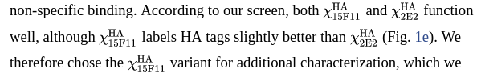

# 17July2020 zFish Talk 

---------
17July2020
---------

**Fluorescent immunoassay:**

>"We next tested the suitability of the HA frankenbody for Western blotting. For this, we harvested U2OS cells expressing HA-tagged H2B or β-actin. In contrast to the parental 12CA5 anti-HA antibody, which we had to stain with a secondary antibody, we could detect the frankenbody in blots using the GFP signal alone. Similar bands were seen in both cases ([Fig. 3c](https://www.ncbi.nlm.nih.gov/corecgi/tileshop/tileshop.fcgi?p=PMC3&id=791489&s=89&r=1&c=1) and Supplementary Fig. 3). Although several of the bands were dimmer than those using the antibody, we attributed the difference to signal amplification from the secondary antibody. Together, our Western blot and immunostaining results demonstrate the HA frankenbody can serve as a cost-effective replacement for the anti-HA antibody in widely used in vitro applications." - Zhao 2019

{ width=35% }

Also:

>"MCP-HaloTag was purified by immobilized metal affinity chromatography. Briefly, the His-tagged MCP-HaloTag was purified through a Ni-NTA-agarose (Qiagen) packed column per the manufacturer’s instructions, with minor modifications. E. coli expressing the interested protein was lysed in a PBS buffer with a complete set of protease inhibitors (Roche) and 10 mM imidazole. The resin was washed with PBS-based buffer containing 20 and 50 mM imidazole. The protein was then eluted in a PBS buffer with 300 mM imidazole. The eluted His-tagged MCP was dialyzed in a HEPES-based buffer (10% glycerol, 25 mM HEPES pH 7.9, 12.5 mM MgCl2, 100 mM KCl, 0.1 mM EDTA, 0.01% NP-40 detergent, and 1 mM DTT), snap-frozen in liquid nitrogen, and then stored at −80 °C." - Zaho 2019

**My Conclusion:**

* [pET23b-15F11-HA-mEGFP-6xHis](https://www.addgene.org/129593/)
* [pCMV-15F11-HA-mCh](https://www.addgene.org/129591/)
* [pCMV-15F11-HA-mEGFP](https://www.addgene.org/129590/)

According to this:

I will take 15F11 scafold grafts. The -6xHis version is for metal purification attempts. Both colors - mCherry and mEGFP are chosen.

`END OF TRANSMISSION`

